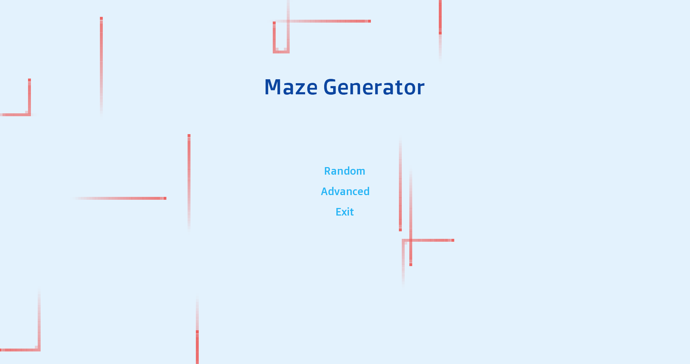
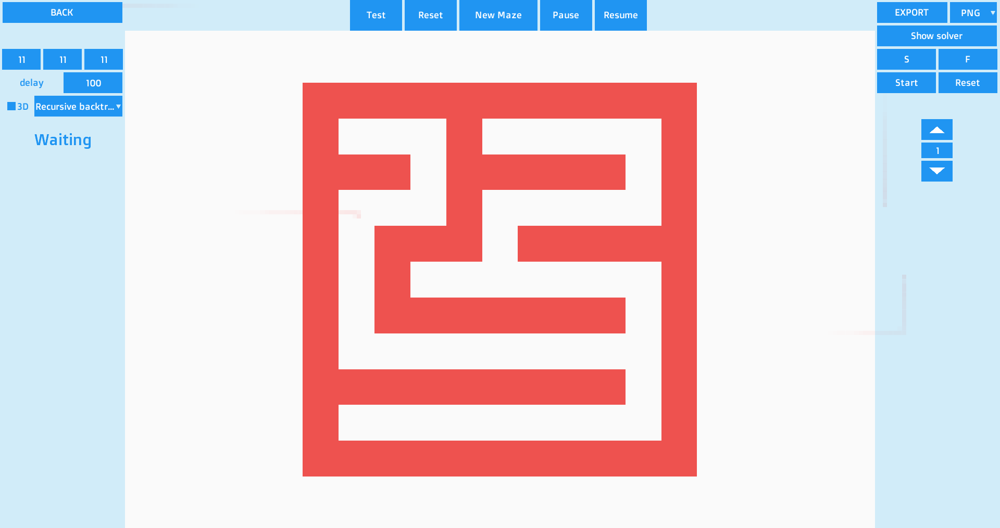
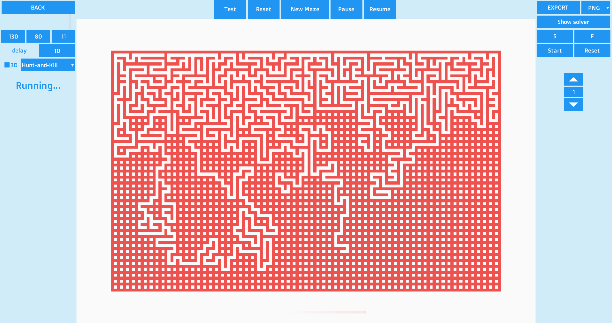
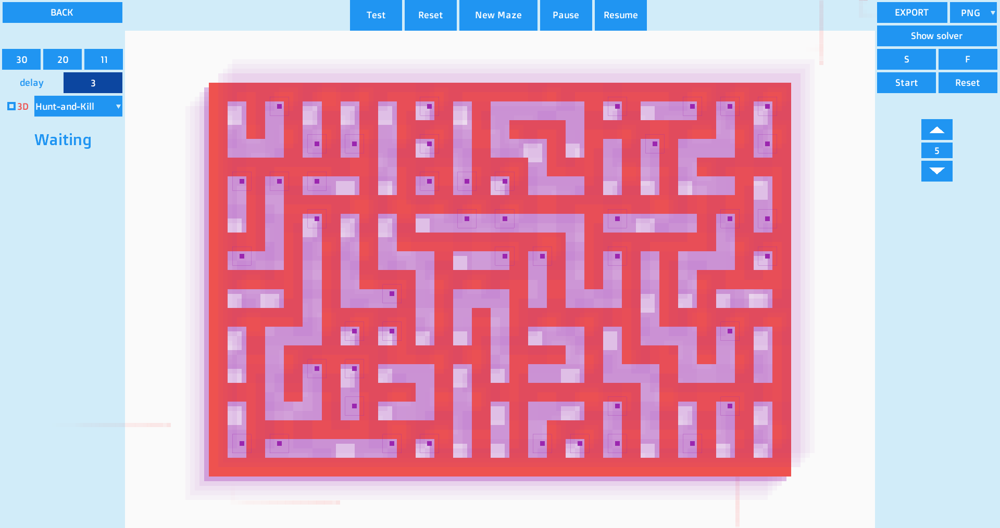
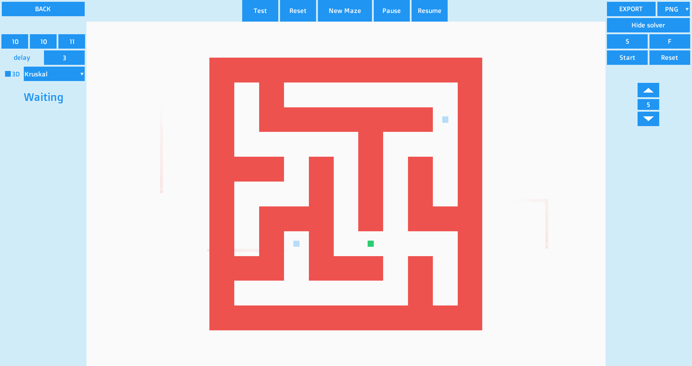

# MazeGenerator

Vultur Iulian 

Made using the LibGDX framework for the interface, apache batik library and java awt for exporting and Spark miniframework for an api to returun random generated maze created with the algorithms.

## Features
Randomly generated 2D and 3D mazes using one the selected algorithm and with the specified dimentions.
A solver with the possibility to select the starting and ending locations.
Export the mazes as different fromats
* PNG
* JPG
* SVG
* JSON
* TXT

An api with parameters for algorithm used and dimenstions
`
/:alg_name/:maze_width/:maze_height
`
## Screenshots

